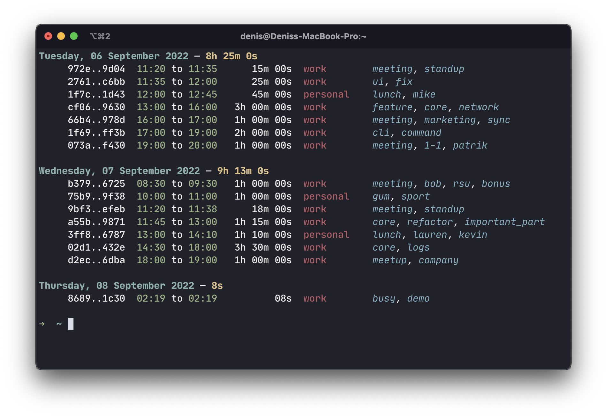

# Simple CLI time tracker

[](https://asciinema.org/a/WuIMSZ4mEIDa4yScWPPUykvkW)
Check [screencast](https://asciinema.org/a/WuIMSZ4mEIDa4yScWPPUykvkW)

Busy is the time tracker which helps you to manage daily routine and remember next day what you did.

Busy implements sync through git repository. Check [sync](#sync) section for details.

## Installation

```
cargo install --git https://github.com/zloylos/busy.git
```

## Workflow

### Create a new task

There are four ways to create a new task:

- start task right now:

```
busy start my-project "Task description" +tag1 +tag2 +tag3
```

- start task with start point:

```
busy start --start-time "11:05" my-project "Task description" +tag1 +tag2 +tag3
```

- add finished task:

```
busy add --start-time "11:05" --finish-time "12:00" my-project "Task description" +tag1 +tag2 +tag3
```

- continue existing task (create a new one with start-time == now):

```
busy continue <task-id>
```

### Stop & pause tasks

When you finished with a task, you can stop it:
`busy stop`

If you need take a break, you can just pause a task:

```
busy pause
```

and resume it later:

```
busy resume
```

### Show tasks

Default way to check your tasks is call `busy log`. It will show you all tasks since the beginning of the week. You can also specify days count:

```
busy log --days 7
```

If you want to see description of a task, you can use `busy log --full`.

There are also some other ways to show tasks such as `busy today` to show tasks for today and `busy status` to show current task.

### Edit tasks

You can edit tasks with `busy edit --task <task-id>` command. It will open your default editor with task json view. After you save changes, task will be updated.

### Sync

busy implements sync through git repository. To enable it, you need to create a new git repository and add it as a remote:

```
export BUSY_REMOTE=git@github.com:your-name/private-busy-sync.git
```

Make sure that you have ssh key for this repository.

Then you can sync your tasks with `busy sync` command. If you need to foce sync, you can use `busy sync --force-push` or `busy sync --force-pull` command.

You can also specify a branch name for sync:

```
export BUSY_REMOTE_BRANCH=main
```

### Tips

To not forget to stop a task, you can add `busy status` to your `~/.bashrc` or `~/.zshrc`
